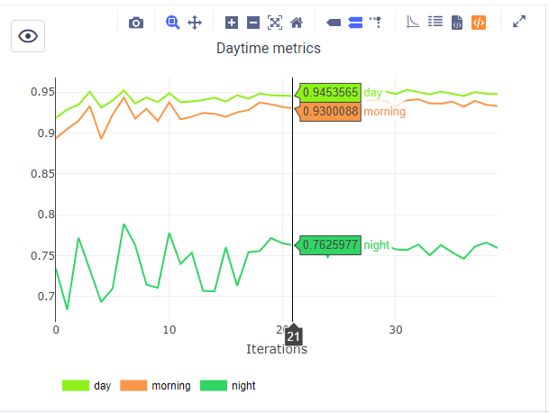
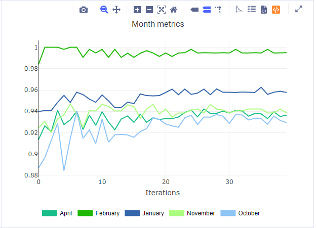
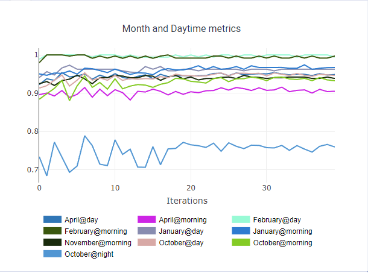
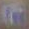
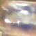
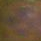
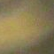

# TrafficSignRecognition

Проект для классификации дорожных знаков

# Датасет

В качестве датасета был выбран Russian traffic sign images dataset
https://computeroptics.ru/eng/KO/PDF/KO41-ENG%20-17/400221.pdf

# Выбор класов

В работе список классов был сужен до тех, которые имеют в train хотя бы 90 семплов, а в валидации хотя бы 40

# Отслеживание качества

В качестве основной метрики использовался weighted avg F1 score. Также при оценке качества было необходимо понимать как приложение способно работать при различных погодных условиях и уровнях освещения. Используя информацию о дате и времени съемки, представленной в датасете, было принято решение отдельно считать метрики по месяцам, временам суток (сутки были условно поделены на утро, день, вечер и ночь) и сочетаниям (месяц, время суток), так как, например, 7 утра в январе и в июне сильно отличаются по уровню освещения.

Примеры графиков в ClearML

# Эксперименты

Тестировались модели resnet18 и resnet34. В качестве аугментаций использовались стандартные афинные преобразования и аугментации контрастности. Для снижения эффекта дисбаланса классов использовался focal loss. Также тестировались погодные аугментации из albumentations (RandomSnow, RandomRain, RandomFog).

Во всех экспериментах модель сильно проседала на кадрах записанных ночью, а особенно в октябре ночью. При анализе фейлов на этом сабсете было обнаружено большое количество изображений с сильным motion blur

Примеры фейлов:

Для борьбы с такими фейлами была добавлена аугментация MotionBlur из albumentations

Также были фейлы, скорее всего вызванные плохой освещенностью

Для борьбы с плохой освещенностью были попытки добавить HistEqualization но на некоторых семплах визуально казалось, что это очень плохо работает, поэтому этот эксперимент был отложен.

# Эксперименты в ClearML

Ниже представленны ссылки на все эксперименты в хронологическом порядке 

https://app.clear.ml/projects/948a0b4e66f144d9a7d21a4e512b19ba/experiments/c0b91230e0334e4b905e102c19f29b2f/output/execution

https://app.clear.ml/projects/948a0b4e66f144d9a7d21a4e512b19ba/experiments/08b95e3b3887461e928913a21fd3b42b/output/execution

https://app.clear.ml/projects/948a0b4e66f144d9a7d21a4e512b19ba/experiments/fb7a86ced3304192a4dd42afa74443fb/output/execution

https://app.clear.ml/projects/948a0b4e66f144d9a7d21a4e512b19ba/experiments/2387d3c175a44ec5b8518a3b8c5a51d9/output/execution

https://app.clear.ml/projects/948a0b4e66f144d9a7d21a4e512b19ba/experiments/7d118872510c417a837ee2404f615d5f/output/execution